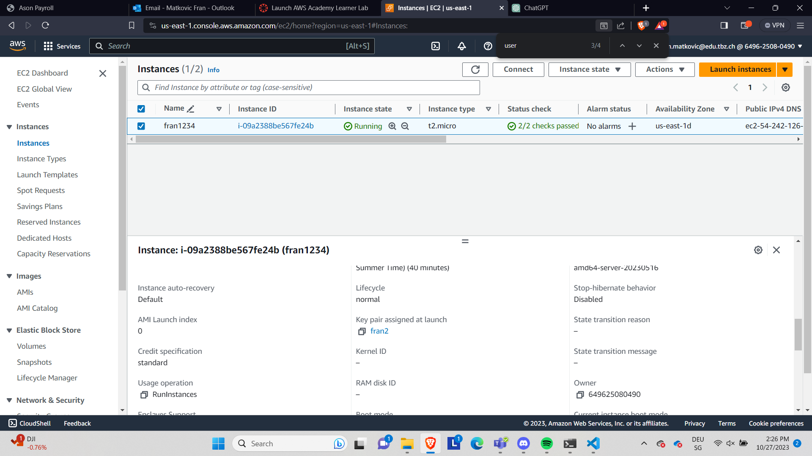
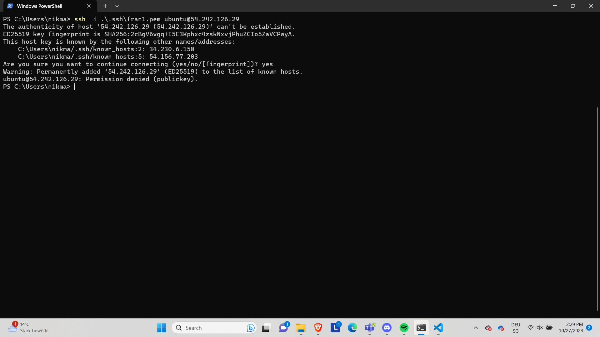
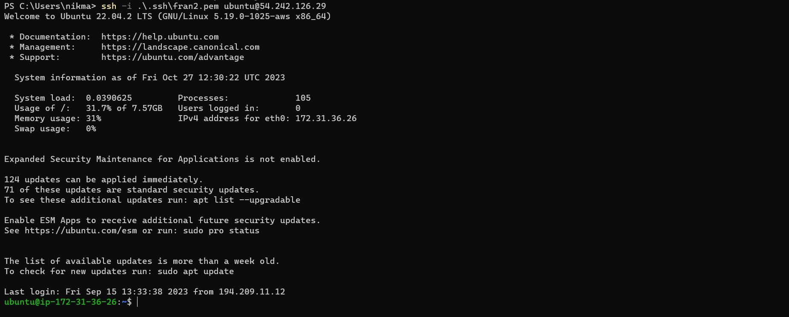
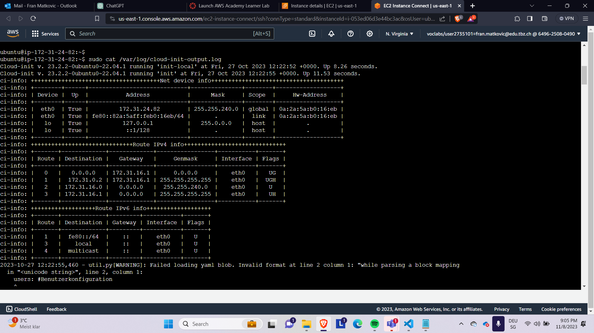
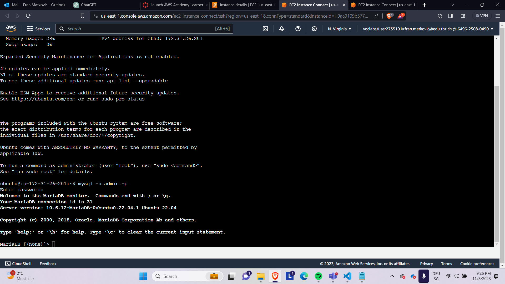
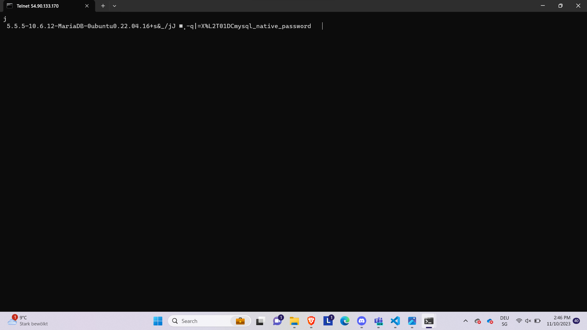
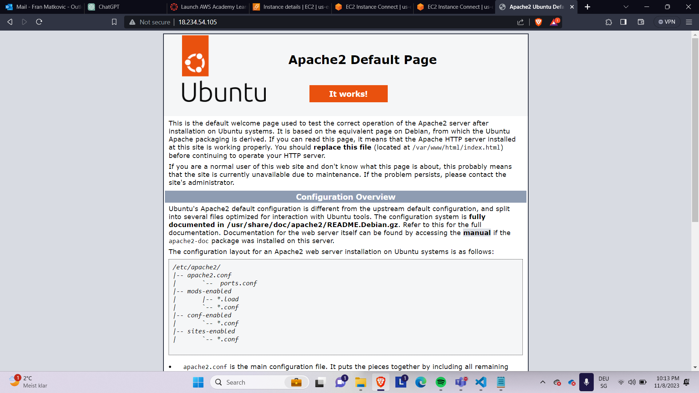
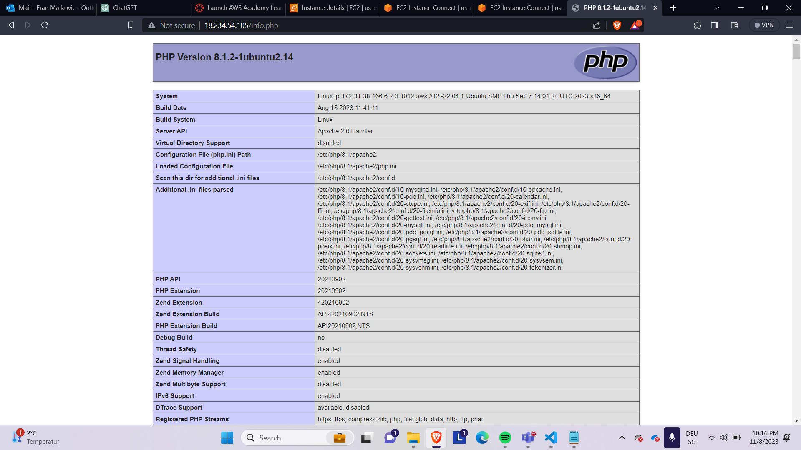
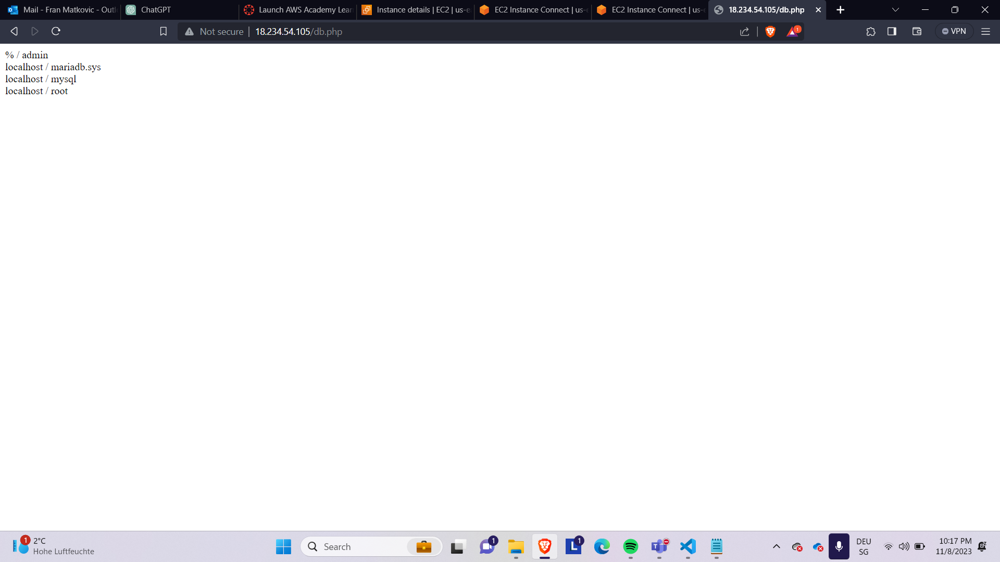
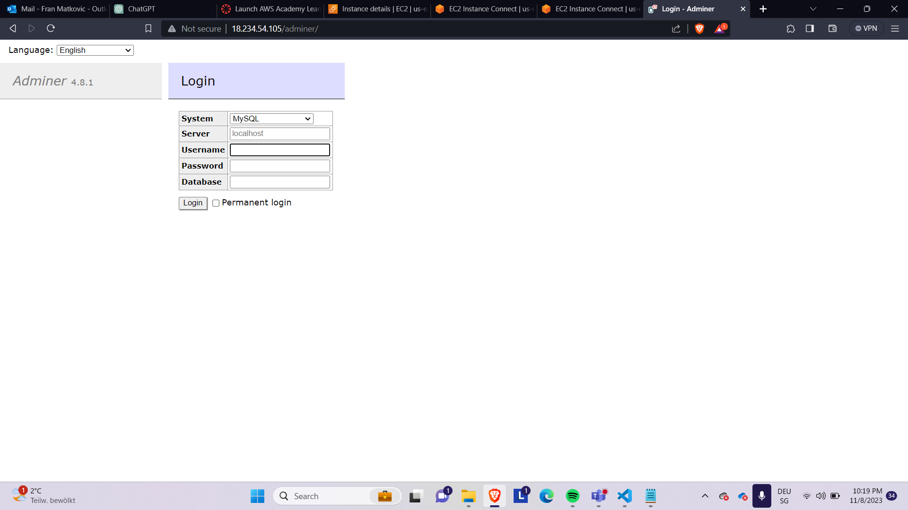

# KN03

## A

```
#cloud-config
users: #Benutzerkonfiguration
  - name: ubuntu #Benutzername wird definiert
    sudo: ALL=(ALL) NOPASSWD:ALL #braucht password nicht für Befehle
    groups: users, admin #Gruppe users und admin hinzugefügt.
    home: /home/ubuntu #Home verzeichnis
    shell: /bin/bash #man gibt an, dass standardshell bash ist
    ssh_authorized_keys:
      - ssh-rsa AAAAB3NzaC1yc2EAAAADAQABAAABAQC0WGP1EZykEtv5YGC9nMiPFW3U3DmZNzKFO5nEu6uozEHh4jLZzPNHSrfFTuQ2GnRDSt+XbOtTLdcj26+iPNiFoFha42aCIzYjt6V8Z+SQ9pzF4jPPzxwXfDdkEWylgoNnZ+4MG1lNFqa8aO7F62tX0Yj5khjC0Bs7Mb2cHLx1XZaxJV6qSaulDuBbLYe8QUZXkMc7wmob3PM0kflfolR3LE7LResIHWa4j4FL6r5cQmFlDU2BDPpKMFMGUfRSFiUtaWBNXFOWHQBC2+uKmuMPYP4vJC9sBgqMvPN/X2KyemqdMvdKXnCfrzadHuSSJYEzD64Cve5Zl9yVvY4AqyBD aws-key #(SSH-Schlüssel) wird bei der Authentifizierung hinzugefügt
ssh_pwauth: false # Diese Zeile deaktiviert die SSH-Passwortauthentifizierung für den Benutzer "ubuntu", sodass nur der SSH-Schlüssel für die Authentifizierung verwendet wird.
disable_root: false #man gibt an, dass der root-benutzer nicht deaktiviert ist
package_update: true #system wird beim start aktualisiert
packages: #installation von packages
  - curl #package curl wird installiert
  - wget #packages wget wird installiert
```

## B

Cloud-init

```
#cloud-config
users: #Benutzerkonfiguration
  - name: ubuntu #Benutzername wird definiert
    sudo: ALL=(ALL) NOPASSWD:ALL #braucht password nicht für Befehle
    groups: users, admin #Gruppe users und admin hinzugefügt.
    home: /home/ubuntu #Home verzeichnis
    shell: /bin/bash #man gibt an, dass standardshell bash ist
    ssh_authorized_keys:
      - ssh-rsa AAAAB3NzaC1yc2EAAAADAQABAAABAQDjeUEfHF/l/T1tYThfhEOO/SN+QLaCy9uLQ+uaZE25DHqclEilkz5xU2umEa4D1M3g2xZNcGeUEzUd0lXkeHjXzZpyPqoJ8bZaPvH7zPniWKOiIn/j/CrbqSS34GT29gHd171dlYKz0cc3gmfKIZia0CKz8QmYqPDBe9i9mEX5oMrS1juXdbtOJb4RLCMomHptn0hJoM+orqCVJ5eIHvku26YaP0TOwpdlH6k9EVVNBN1bRU8e1ymnz+xRP1tJTJMLtvrSqdYjfn4TcsOqF3M7Yos2fRf/j46N74rcevbGrqrL43cUMyc65ar8V+zJL9y3LSQMy0xr8xb+VNDnHi9X
ssh_pwauth: false # Diese Zeile deaktiviert die SSH-Passwortauthentifizierung für den Benutzer "ubuntu", sodass nur der SSH-Schlüssel für die Authentifizierung verwendet wird.
disable_root: false #man gibt an, dass der root-benutzer nicht deaktiviert ist
package_update: true #system wird beim start aktualisiert
packages: #installation von packages
  - curl #package curl wird installiert
  - wget #packages wget wird installiert
```

### 1

Key pair


### 2

erster Schlüssel


### 3

zweiter Schlüssel


### 4

Auszug


## Aufgabe_C

```
#cloud-config
users: # Dies ist der Beginn einer Liste von Benutzerkonfigurationen
  - name: ubuntu # Hier wird ein Benutzer mit dem Namen ubuntu erstellt
    sudo: ALL=(ALL) NOPASSWD:ALL # Dies ermöglicht dem Benutzer ubuntu, alle Befehle mit administrativen Rechten ohne Passwortabfrage auszuführen
    groups: users, admin # Der Benutzer ubuntu wird den Gruppen users und admin hinzugefügt
    home: /home/ubuntu # Dies legt das Heimatverzeichnis des Benutzers ubuntu auf /home/ubuntu fest
    shell: /bin/bash # Der Benutzer ubuntu verwendet die Bash-Shell
    ssh_authorized_keys: #  Hier können öffentliche SSH-Schlüssel für die Benutzerauthentifizierung hinzugefügt werden. In diesem Beispiel wird ein SSH-Schlüssel (Beginnend mit ssh-rsa) angegeben
      - ssh-rsa AAAAB3NzaC1yc2EAAAADAQABAAABAQDI07wMGpDGKeLzZ+K8MEiEIbQHkLM9ygplmtt0KNsTFOjF2Id1O488V1BGAJDfLVXaGdfRf5MRdoWbn2vfR49/U7eNsD5Elk3T+NiM+Nq2WNiHJ9i95W6jJzYO7WEFzPJfpbFJM5oi3LiCyjMWhZ+AtEMS9mRqgZ3EEhX4yK2qkMp7Tp2A5F6PeWpQLicoxSRuO5qgsEGjSXxvfFue4A5sknqZFez+h6Yamy8IYnd9gYI8NlphvpXc2y8NaWfVLeZYndx4Wv7Cw51cqhW07vpsAiIX/HVXmwdXyFDvsjvWxVNAqKx+VHiHoT4Y8gA9lfty3xkIVqW0yRacZV3qC8NP
      - ssh-rsa AAAAB3NzaC1yc2EAAAADAQABAAACAQCz/wpWmsCxaQyuNFrIachc/q9nUdByoUcBcicl/wnKLFktKp6du9np9Uhmo4M0tVHNnWCt5uNEi2ks/0XEbg2J+4heuAAKEDr/TVbgabiWGclYKpEWZvmw8gsQwfpAKVG4aS2re7wB2uhw82ZqzJVpGm3ne+sNnz5uVrxN8HUnuR2OWJD6bA9l/fBmE6zdObVXgrCJGjZmVyB5GMeTDJKExgoBpLggZn9CNdu7Sx989xtNLehu6SWM+mGCq9Lcu7usiPG+SuEb8XynYaCOnv8+Oko6SYeJ9Omq/E7Eg6vZHqCbBQ81TIZrGKcikLmF2xP7EOprGOSPVewke7ak7vvmOI+p/RfIAyXj1+GYny+esk9G+qDRFXP9uiIlMfH1oGkQkztvSDMH+EOHqgY66NWQJPj83CaWH/euR0MROHXjm1ar3RuN9qcASAnzCOQQ1FMwFkpIV5x0NDRx0Zp1rLt8ZUFykmIuHZI4g9u6RdAiuWUxx9/eF0fXZa6Ju7GEMKeMtZxJJjmB/WCOylbkT+NPw5RcxgyRLKmUAicnYKXBmULY3pQM/Ui8KiCyJqRbLDBAR+XZYsZ7X5uhcuteu8KIfA2xEbInB4Q3c0DnnSih+GEC4pEbz+NOfeCpLJEn4gfyV1S9S08sG62ls8NPFociA9aWmE1oXfcqwvOkkYhxOw== aws key
      - ssh-rsa AAAAB3NzaC1yc2EAAAADAQABAAABAQCtVn+PW7WhGzat69H3DObpJx+YqfPm15uywnEYulBN9DZd6t/pRXJ+0RqBpF99a0B7Qk5vH4cGgEBjC9zjOAvNiCVx1SNm72dZ+8sFpehWiT6y0+YpUc+t6vEEHZMNSf6t3z5NlxlTggzO0EiW1vptUjJxISvFJokrgqsmRt+PlAAd+ij4X2COp1yKFFlKyr7NMIw9zyHwR6+IWaTZCfb5F+M4+bLw8IVnRwrxyOWkLoyHM/6G7Xz/4XCgAv0S2nAcgPjBXuUw6w4Ut8XQvG9SYqU9GvlZqrfvi3wQRsR5VZ8KXK8RYmZ2km1fq6fzEIZN+hqFjdW1f aws key

ssh_pwauth: false # Die SSH-Passwortauthentifizierung ist deaktiviert
disable_root: false # Die Root-Authentifizierung ist nicht deaktiviert, was bedeutet, dass der Root-Benutzer weiterhin SSH verwenden kann
package_update: true # Dies bedeutet, dass das System nach der Konfiguration auf aktualisierte Pakete überprüft werden soll
packages: # Hier werden Pakete aufgelistet, die auf dem System installiert werden sollen. In diesem Fall sind es curl und wget
  - curl
  - wget
```

## Aufgabe_D

### dbConfig yaml

```
#cloud-config
users:
  - name: ubuntu #username
    sudo: ALL=(ALL) NOPASSWD:ALL #sudo-Regeln für diesen Benutzer
    groups: users, admin #Fügt den Benutzer "ubuntu" zu den Gruppen "users" und "admin" hinzu
    home: /home/ubuntu #Setzt das Homeverzeichnis des Benutzers auf
    shell: /bin/bash #Legt die Standard-Shell für den Benutzer auf /bin/bash fest
    ssh_authorized_keys: #Erlaubt die Festlegung von SSH-Schlüsseln für den Benutzer. In diesem Fall wird ein SSH-Schlüssel angegeben.
      - ssh-rsa AAAAB3NzaC1yc2EAAAADAQABAAABAQDjeUEfHF/l/T1tYThfhEOO/SN+QLaCy9uLQ+uaZE25DHqclEilkz5xU2umEa4D1M3g2xZNcGeUEzUd0lXkeHjXzZpyPqoJ8bZaPvH7zPniWKOiIn/j/CrbqSS34GT29gHd171dlYKz0cc3gmfKIZia0CKz8QmYqPDBe9i9mEX5oMrS1juXdbtOJb4RLCMomHptn0hJoM+orqCVJ5eIHvku26YaP0TOwpdlH6k9EVVNBN1bRU8e1ymnz+xRP1tJTJMLtvrSqdYjfn4TcsOqF3M7Yos2fRf/j46N74rcevbGrqrL43cUMyc65ar8V+zJL9y3LSQMy0xr8xb+VNDnHi9X
      - ssh-rsa AAAAB3NzaC1yc2EAAAADAQABAAACAQCz/wpWmsCxaQyuNFrIachc/q9nUdByoUcBcicl/wnKLFktKp6du9np9Uhmo4M0tVHNnWCt5uNEi2ks/0XEbg2J+4heuAAKEDr/TVbgabiWGclYKpEWZvmw8gsQwfpAKVG4aS2re7wB2uhw82ZqzJVpGm3ne+sNnz5uVrxN8HUnuR2OWJD6bA9l/fBmE6zdObVXgrCJGjZmVyB5GMeTDJKExgoBpLggZn9CNdu7Sx989xtNLehu6SWM+mGCq9Lcu7usiPG+SuEb8XynYaCOnv8+Oko6SYeJ9Omq/E7Eg6vZHqCbBQ81TIZrGKcikLmF2xP7EOprGOSPVewke7ak7vvmOI+p/RfIAyXj1+GYny+esk9G+qDRFXP9uiIlMfH1oGkQkztvSDMH+EOHqgY66NWQJPj83CaWH/euR0MROHXjm1ar3RuN9qcASAnzCOQQ1FMwFkpIV5x0NDRx0Zp1rLt8ZUFykmIuHZI4g9u6RdAiuWUxx9/eF0fXZa6Ju7GEMKeMtZxJJjmB/WCOylbkT+NPw5RcxgyRLKmUAicnYKXBmULY3pQM/Ui8KiCyJqRbLDBAR+XZYsZ7X5uhcuteu8KIfA2xEbInB4Q3c0DnnSih+GEC4pEbz+NOfeCpLJEn4gfyV1S9S08sG62ls8NPFociA9aWmE1oXfcqwvOkkYhxOw== aws key
      - ssh-rsa AAAAB3NzaC1yc2EAAAADAQABAAABAQC0WGP1EZykEtv5YGC9nMiPFW3U3DmZNzKFO5nEu6uozEHh4jLZzPNHSrfFTuQ2GnRDSt+XbOtTLdcj26+iPNiFoFha42aCIzYjt6V8Z+SQ9pzF4jPPzxwXfDdkEWylgoNnZ+4MG1lNFqa8aO7F62tX0Yj5khjC0Bs7Mb2cHLx1XZaxJV6qSaulDuBbLYe8QUZXkMc7wmob3PM0kflfolR3LE7LResIHWa4j4FL6r5cQmFlDU2BDPpKMFMGUfRSFiUtaWBNXFOWHQBC2+uKmuMPYP4vJC9sBgqMvPN/X2KyemqdMvdKXnCfrzadHuSSJYEzD64Cve5Zl9yVvY4AqyBD aws key
ssh_pwauth: false
disable_root: false
package_update: true
packages:
  - curl
  - wget
  - mariadb-server
runcmd:
  - sudo mysql -sfu root -e "GRANT ALL ON *.* TO 'admin'@'%' IDENTIFIED BY 'password' WITH GRANT OPTION;"
  - sudo sed -i 's/127.0.0.1/0.0.0.0/g' /etc/mysql/mariadb.conf.d/50-server.cnf
  - sudo systemctl restart mariadb.service
```

### Webserver-config yaml

```
#cloud-config
users:
  - name: ubuntu #username
    sudo: ALL=(ALL) NOPASSWD:ALL #sudo-Regeln für diesen Benutzer
    groups: users, admin #Fügt den Benutzer "ubuntu" zu den Gruppen "users" und "admin" hinzu
    home: /home/ubuntu #Setzt das Homeverzeichnis des Benutzers auf
    shell: /bin/bash #Legt die Standard-Shell für den Benutzer auf /bin/bash fest
    ssh_authorized_keys: #Erlaubt die Festlegung von SSH-Schlüsseln für den Benutzer. In diesem Fall wird ein SSH-Schlüssel angegeben.
      - ssh-rsa AAAAB3NzaC1yc2EAAAADAQABAAABAQDjeUEfHF/l/T1tYThfhEOO/SN+QLaCy9uLQ+uaZE25DHqclEilkz5xU2umEa4D1M3g2xZNcGeUEzUd0lXkeHjXzZpyPqoJ8bZaPvH7zPniWKOiIn/j/CrbqSS34GT29gHd171dlYKz0cc3gmfKIZia0CKz8QmYqPDBe9i9mEX5oMrS1juXdbtOJb4RLCMomHptn0hJoM+orqCVJ5eIHvku26YaP0TOwpdlH6k9EVVNBN1bRU8e1ymnz+xRP1tJTJMLtvrSqdYjfn4TcsOqF3M7Yos2fRf/j46N74rcevbGrqrL43cUMyc65ar8V+zJL9y3LSQMy0xr8xb+VNDnHi9X
      - ssh-rsa AAAAB3NzaC1yc2EAAAADAQABAAACAQCz/wpWmsCxaQyuNFrIachc/q9nUdByoUcBcicl/wnKLFktKp6du9np9Uhmo4M0tVHNnWCt5uNEi2ks/0XEbg2J+4heuAAKEDr/TVbgabiWGclYKpEWZvmw8gsQwfpAKVG4aS2re7wB2uhw82ZqzJVpGm3ne+sNnz5uVrxN8HUnuR2OWJD6bA9l/fBmE6zdObVXgrCJGjZmVyB5GMeTDJKExgoBpLggZn9CNdu7Sx989xtNLehu6SWM+mGCq9Lcu7usiPG+SuEb8XynYaCOnv8+Oko6SYeJ9Omq/E7Eg6vZHqCbBQ81TIZrGKcikLmF2xP7EOprGOSPVewke7ak7vvmOI+p/RfIAyXj1+GYny+esk9G+qDRFXP9uiIlMfH1oGkQkztvSDMH+EOHqgY66NWQJPj83CaWH/euR0MROHXjm1ar3RuN9qcASAnzCOQQ1FMwFkpIV5x0NDRx0Zp1rLt8ZUFykmIuHZI4g9u6RdAiuWUxx9/eF0fXZa6Ju7GEMKeMtZxJJjmB/WCOylbkT+NPw5RcxgyRLKmUAicnYKXBmULY3pQM/Ui8KiCyJqRbLDBAR+XZYsZ7X5uhcuteu8KIfA2xEbInB4Q3c0DnnSih+GEC4pEbz+NOfeCpLJEn4gfyV1S9S08sG62ls8NPFociA9aWmE1oXfcqwvOkkYhxOw== aws key
      - ssh-rsa AAAAB3NzaC1yc2EAAAADAQABAAABAQCtVn+PW7WhGzat69H3DObpJx+YqfPm15uywnEYulBN9DZd6t/pRXJ+0RqBpF99a0B7Qk5vH4cGgEBjC9zjOAvNiCVx1SNm72dZ+8sFpehWiT6y0+YpUc+t6vEEHZMNSf6t3z5NlxlTggzO0EiW1vptUjJxISvFJokrgqsmRt+PlAAd+ij4X2COp1yKFFlKyr7NMIw9zyHwR6+IWaTZCfb5F+M4+bLw8IVnRwrxyOWkLoyHM/6G7Xz/4XCgAv0S2nAcgPjBXuUw6w4Ut8XQvG9SYqU9GvlZqrfvi3wQRsR5VZ8KXK8RYmZ2km1fq6fzEIZN+hqFjdW1f aws key
ssh_pwauth: false
disable_root: false
package_update: true
write_files:
  - path: /var/www/html/db.php
    content: |
      <?php
        //database
        $servername = "172.31.26.201";
        $username = "admin";
        $password = "password";
        $dbname = "mysql";
        // Create connection
        $conn = new mysqli($servername, $username, $password, $dbname);
        // Check connection
        if ($conn->connect_error) {
                die("Connection failed: " . $conn->connect_error);
        }
        $sql = "select Host, User from mysql.user;";
        $result = $conn->query($sql);
        while($row = $result->fetch_assoc()){
                echo($row["Host"] . " / " . $row["User"] . "<br />");
        }
        //var_dump($result);
      ?>
  - path: /var/www/html/info.php
    content: |
      <?php
      // Show all information, defaults to INFO_ALL
      phpinfo();
      ?>
packages:
  - curl
  - wget
  - apache2
  - php
  - libapache2-mod-php
  - php-mysqli
  - adminer
runcmd:
  - sudo a2enconf adminer
  - sudo systemctl restart apache2
```

### 1



### 2



### 3



### 4



### 5



### 6


