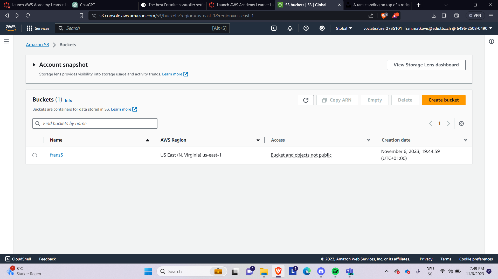
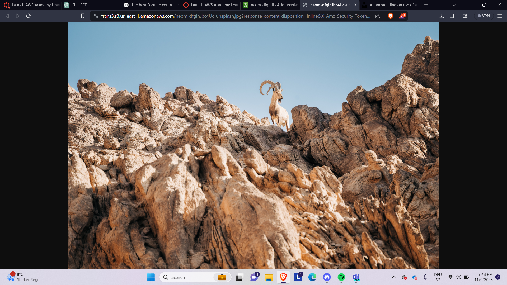
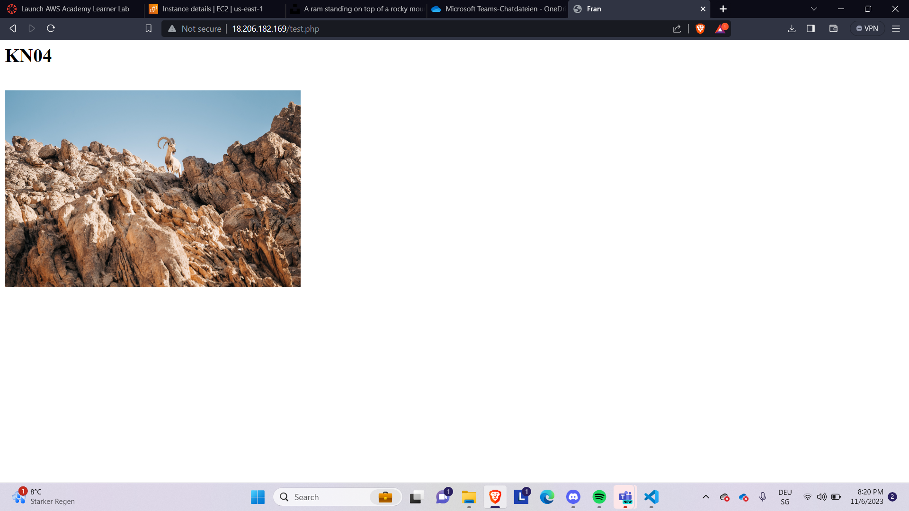
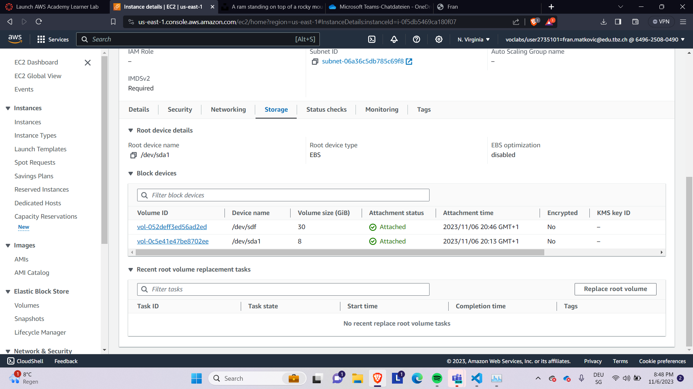

# KN04

## A

### s3-objekte



### URL



## B

### Cloud-Init

```
#cloud-config
users:
  - name: ubuntu
    sudo: ALL=(ALL) NOPASSWD:ALL
    groups: users, admin
    home: /home/ubuntu
    shell: /bin/bash
    ssh_authorized_keys:
      - ssh-rsa AAAAB3NzaC1yc2EAAAADAQABAAABAQCAUA/YPKxRr+vB5dNzDzg3YVVL9TRSqZ7vLuL1CWn6IfNCFU4icssWR6sOfuBIx9El7JjLbm/xYFrlSPtVAFNeccgKj69u+RHVu1QktoKrY7CtvUayhZiBRZHuTb++AXv6DvwyH+/JF9APQNy2IPwtUcmIcyyjshj4mYyQvo2suVGCiIfZASapYXcobBKSzgBQUQgXmDJiI9x0EmDPpStXLohML9hcJnujEF1VXIV5qGNWnK1PfWFa0FDrYXmqVWmTkcuPsa4yQ2e5TbSAkJS04Wnaxz41EgWVHHmcwsz2dSwQ8SM4sFQVPkwEHaPdhgtOX1RUDckTcZBm+eJADBZL Ahmadpub1
disable_root: false
package_update: true
packages:
  - curl
  - wget
  - apache2
  - php
  - libapache2-mod-php
write_files:
  - content: |
      <?php phpinfo(); ?>
    path: /var/www/html/info.php
    permissions: "0644"
  # Ab hier wird das gesuchte PHP-File erstellt
  - content: |
      <?php
      $ihrname = "Fran";
      ?>

      <html>
      <head>
      <title><?php echo $ihrname; ?></title>
      </head>
      <body>
      <h1>KN04</h1>
      <br />
      
      </body>
      </html>

    path: /var/www/html/test.php
    permissions: "0644"
runcmd:
  - sudo systemctl restart apache2

```

### image.php



## C

### EBS(2 Volumen)


