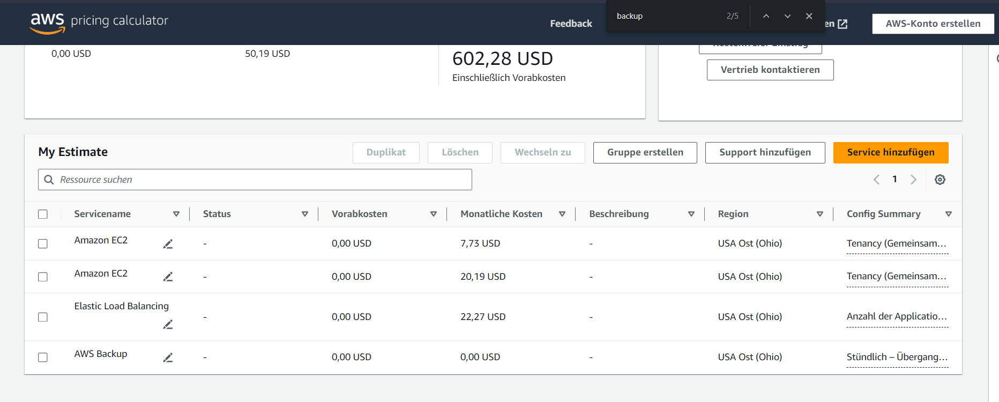
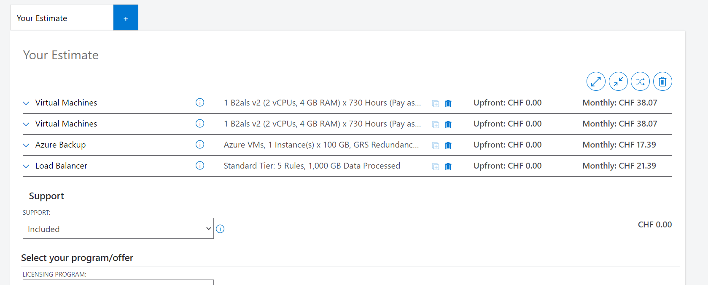
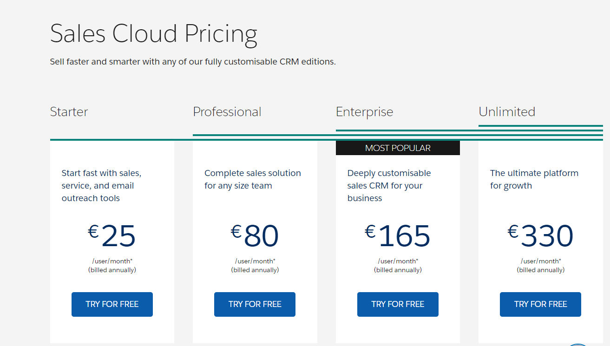

# KN07

## B

### AWS

Webserver: 1 Kern, 2 GB RAM, 20 GB Speicher.
Datenbank: 2 Kerne, 4 GB RAM, 100 GB Speicher.
Lastenausgleich: Standardkonfiguration.
Backup: 100 GB für die Datenbank.

### Azure

Systemzusammenfassung: Ein Webserver mit 1 Kern, 2 GB RAM und 20 GB Speicher, eine Datenbank mit 2 Kernen, 4 GB RAM und 100 GB Speicher, ein Standard-Lastenausgleich und ein 100 GB Backup aufgrund des 100 GB Speichers der Datenbank.

### Heroku

Ein Web Server und ein Postgres Datenbank Server bei dem Backup inbegriffen ist.

### Zoho CRM

Die Enterprise-Version bietet erweiterte Funktionen, eine höhere Sicherheit und Skalierbarkeit, weshalb ich sie bevorzugen würde.

### Salesforce

Ein Sales Professional Paket, das sämtliche Funktionen in einer vollständigen CRM-Anwendung enthält.

SaaS-Lösungen sind zwar teurer, aber sie bieten eine vollständige Anwendung. Bei IaaS und PaaS fallen zusätzliche Kosten für Installation, Code-Entwicklung und Verwaltung an. Mit IaaS und PaaS können Sie die Anwendung nach Ihren Wünschen anpassen und eigene Funktionen hinzufügen.

## B

Die Angebote variieren erheblich. Bei IaaS sind umfangreiche Konfigurationen erforderlich, und es ist kostengünstiger, während SaaS teurer ist, aber weniger Aufwand erfordert.

IaaS ist die preiswerteste Option, erfordert jedoch die umfangreichste Konfiguration.

SaaS ist am teuersten, da es eine komplette Anwendung bietet und Sie sich nicht um Entwicklung, Verwaltung und Hosting kümmern müssen. Bei den anderen Optionen fallen zusätzliche Kosten an.
